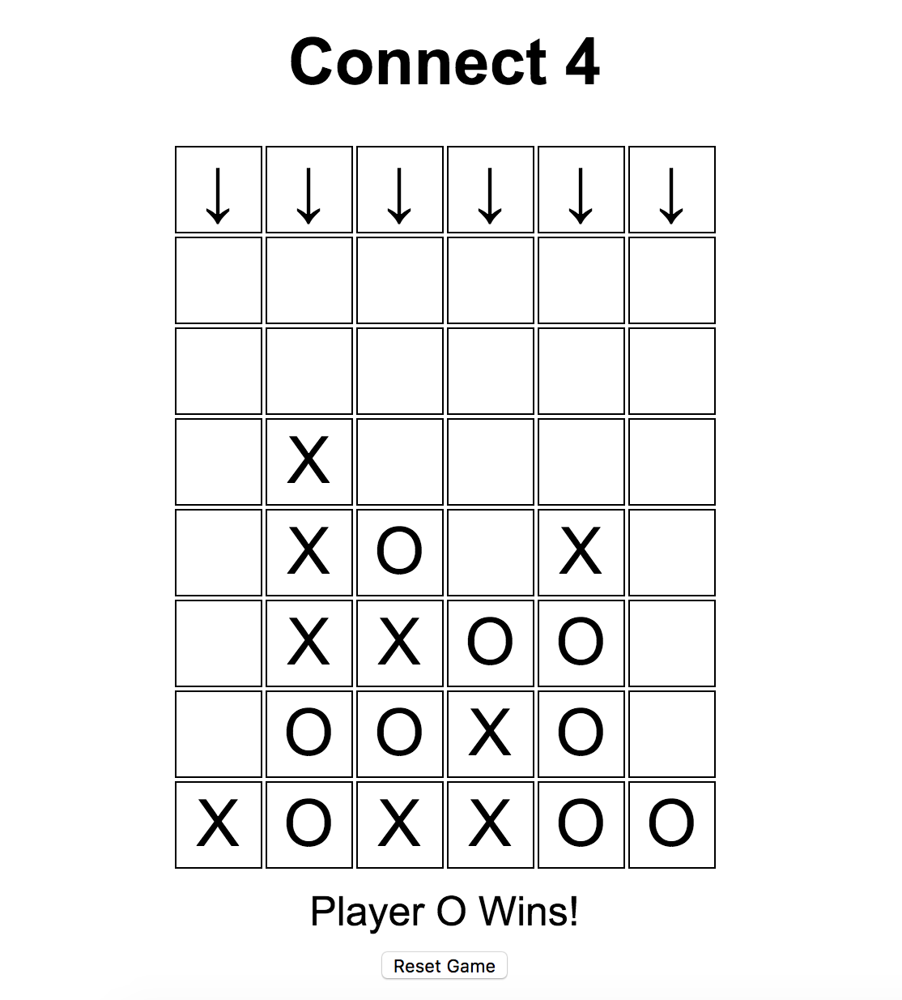

# Connect4

Connect4 is a grid-based game, where players take it in turns to add
tokens. The winner is whoever manages to line up 4 pieces, in any
direction, first. Diagonals are allowed.

https://en.wikipedia.org/wiki/Connect_Four

## Tasks

The aim is to develop an interactive version of the game which the
candidate and interviewer can play together.

A minimal version of the game should support:

- a 6 x 7 grid
- players play pieces sequentially
- the game identifies winning turns and ends at that point

## Installing and Executing

`npm install` primarily for running cypress testing

copy path of `index.html` and paste in to browser

Using the mouse click on the arrows to indicate which column you wish to 'drop' the token in to. Game ends when one player gets 4 in a row either vertically, horizontally or diagonally.

## Testing

Combination of `jamsmine` and `cypress.io`

##### Jasmine

copy path of `SpecRunner.html` and paste in to browser to run

##### Cypress

enter `npm test` in terminal to open up cypress testing windows

## Screen Shot

